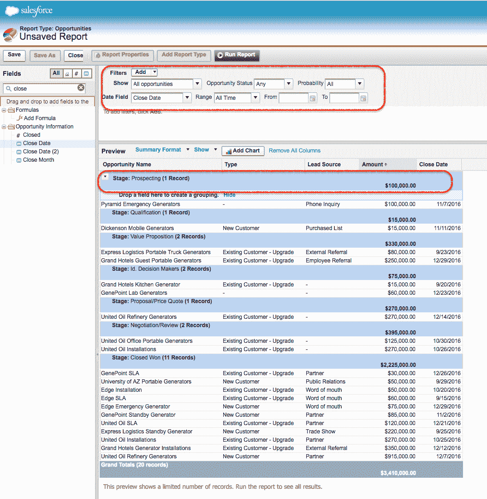

# 汇总您的 Salesforce 报告数据|汇总报告

> 原文：<https://www.tutorialkart.com/salesforce/summary-reports-in-salesforce/>

**汇总报告**类似于表格报告，但这些报告允许对行数据进行分组。行数据最多可以分为四个级别。

*   摘要报告是第二种 [Salesforce](https://www.tutorialkart.com/salesforce/what-is-salesforce/) 报告格式，允许用户对支持排序和显示小计的行数据进行分组。
*   摘要报告显示基于字段值的小计。

## 在 Salesforce.com 创建汇总报表。

Salesforce.com 中的摘要报告类似于表格报告。要创建摘要报告[，请登录 Salesforce](https://www.tutorialkart.com/login-salesforce-login-salesforce-com-salesforce-sign-in/) 并导航至报告|创建新报告。

<figure class="aligncenter"></figure>

在本 [Salesforce 培训](https://www.tutorialkart.com/salesforce/salesforce-reports-dashboards-overview/)教程中，我们将为[对象](https://www.tutorialkart.com/salesforce/how-to-create-salesforce-custom-objects/)机会创建总结报告。

