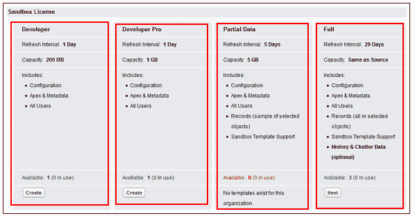

# 不同的 Salesforce 沙盒类型

> 原文：<https://www.tutorialkart.com/salesforce/different-salesforce-sandbox-types/>

在 Salesforce，我们有四种不同的 Salesforce 沙盒类型。了解每种 Salesforce 沙盒类型的优缺点非常有用。不同的 Salesforce 沙盒类型有

1.  全沙盒。
2.  部分数据沙盒。
3.  开发者沙盒和
4.  开发者专业沙盒。

<figure class="aligncenter"></figure>

**Salesforce Sandbox** 是您创建或刷新生产环境时的快照。出于开发、测试和培训等各种目的，在单独的环境中创建沙盒实例，不会影响您的 Salesforce 生产实例中的数据和配置。

## 不同的 Salesforce 沙盒类型

