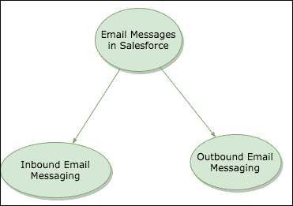

# Salesforce |入站、出站消息中的电子邮件消息

> 原文：<https://www.tutorialkart.com/learn_apex/email-messages-in-salesforce/>

Salesforce 中的电子邮件功能强大、稳健，并提供从 Salesforce 发送电子邮件的安全功能。在本 [Salesforce 教程](https://www.tutorialkart.com/salesforce-tutorials/)中，我们将了解电子邮件编程、不同类型的电子邮件、什么是 Salesforce 中的单封电子邮件和方法、什么是 Salesforce 中的批量电子邮件、在出站电子邮件中附加文件、在 Salesforce 中在出站电子邮件中附加文档。

1.  [sales force 中的电子邮件服务类型](#Types-of-Email-Services)。
2.  [出站电子邮件消息](#Outbound-Email-Messaging)。
    *   [单一电子邮件信息](#Single-Email-Messaging.)。
        *   [单一电子邮件方法](#SingleEmailMessage-Methods)
    *   [群发电子邮件消息。](#MassEmailMessage)
        *   [群发邮件消息方式](#Mass-Email-Message-Methods)。

## sales force 中的电子邮件消息

Salesforce 中的电子邮件功能强大、稳健，并提供从 Salesforce 发送电子邮件的安全功能。从 Salesforce 向外部系统发送和接收电子邮件非常重要，然后我们使用电子邮件服务。在 Salesforce 中，我们有两种类型的电子邮件服务

<figure class="aligncenter"></figure>

1.  入站电子邮件消息
2.  出站电子邮件消息。

