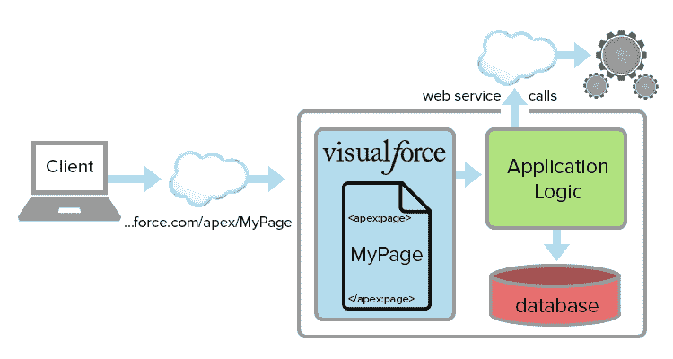

# 为什么在 Salesforce 中使用 Visualforce？

> 原文：<https://www.tutorialkart.com/visualforce/visualforce-used-salesforce/>

您有兴趣知道**为什么在 Salesforce** 中使用 Visualforce 吗？今天，我们清楚地了解了为什么使用 visualforce，以及在 Salesforce 中使用 Visualforce 后会发生怎样的变化。在 [Visualforce 教程](https://www.tutorialkart.com/visualforce-tutorials-learn-salesforce-visualforce-page-coding/)中会涉及更多的概念。让我们了解一下为什么在 Salesforce.com 使用 visualforce。

在我们之前的 [Salesforce 教程](https://www.tutorialkart.com/salesforce-tutorials/salesforce-developer-tutorials/)中，我们了解到 Salesforce 完全没有软件。所以我们为什么要学习用 visualforce 开发。学习 visualforce 有两个主要原因。他们是

## 为什么在 Salesforce 中使用 Visualforce？

1.  扩展和自定义 Salesforce 实例的外观。
2.  使用 Visualforce，我们可以创建具有高度复杂用户界面的全新网站。

<figure class="aligncenter"></figure>

Visualforce 是一种基于标记的标记语言，它有用户界面框架来构建 Visualforce 页面、网站和动态应用程序。Visualforce 支持许多开发技术，如 JQuery、JavaScript、CSS、HTML、Flash 和 Ajax。

**举例** **:** 我们来讨论一下客户**账户**。客户**账户详情页面**在一个长页面上列出所有内容，用户必须上下滚动才能访问。我们可以通过使用 Visualforce 添加选项卡样式来自定义帐户页面导航。

