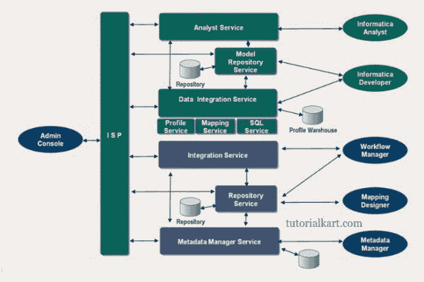

# Informatica 电力中心架构——Informatica 教程

> 原文：<https://www.tutorialkart.com/informatica-tutorial/informatica-powercenter-architecture-informatica-tutorial/>

<figure class="aligncenter"></figure>

## 信息动力中心架构

[Informatica](https://www.tutorialkart.com/what-is-informatica/) 是一个 ETL 工具，用于从各种来源(平面文件、关系数据库、xml 等)提取数据，转换数据，并最终将数据加载到一个集中的位置，如数据仓库或运营数据存储。

Informatica Powercenter 拥有面向服务的架构(SOA ),能够在多台机器上扩展服务和共享资源。 **Informatica PowerCenter 架构**示意图如下。

