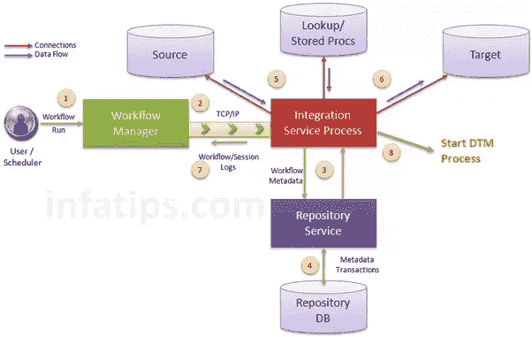

# 什么是 PowerCenter 集成服务？

> 原文：<https://www.tutorialkart.com/informatica-tutorial/what-is-powercenter-integration-service/>

## 什么是 PowerCenter 集成服务？

**PowerCenter 集成服务**基于 PowerCenter 存储库中存储的 PowerCenter 工作流、会话和映射相关元数据，将数据从源移动到目标。当工作流启动时，PowerCenter Integration Service 从存储库中检索映射、会话和工作流相关的元数据。它从映射源提取数据并将数据存储在内存中，同时应用映射中配置的转换规则。

*PowerCenter 集成服务*将转换后的数据加载到一个或多个目标中。为了将数据从源移动到目标，PowerCenter Integration Service 使用的组件有 PowerCenter Integration Service 进程、负载平衡器和[数据转换管理器进程](https://www.tutorialkart.com/data-transformation-manager-dtm-process-in-informatica/) (DTM):

**PowerCenter 集成服务进程**:集成服务启动一个或多个服务进程运行并监控工作流。当工作流运行时，集成服务流程启动并锁定工作流，运行工作流任务，并启动流程以运行会话。

**负载均衡器**:使用负载均衡器调度任务。负载平衡器分派任务以实现最佳性能。它可以将任务分派给网格中的单个节点或多个节点。

**数据转换管理器(DTM)进程**:它启动一个 DTM 进程来运行工作流中的每个会话和命令任务。DTM 进程执行会话验证，创建线程来初始化会话，读取、写入和转换数据，并处理会话前和会话后操作。

<figure class="aligncenter"></figure>

