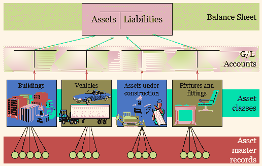

# 如何在 SAP 中创建资产类别|什么是资产类别

> 原文：<https://www.tutorialkart.com/sap-fico/how-to-create-asset-classes-what-is-asset-class/>

在本 [SAP FICO 教程](https://www.tutorialkart.com/sap-fico/sap-fico-tutorial/)中，您将学习什么是资产类别，以及如何通过使用交易代码 OAOA 在 [SAP 系统](https://www.tutorialkart.com/sap/what-is-sap-definition-of-erp-sap-systems/)中创建资产类别。

## SAP /资产类别中的资产类别是什么

在 SAP 中，**资产类别**用于根据资产类型对资产核算中的固定资产进行分类。每个资产主数据必须分配到一个资产类别，例如建筑物、车辆、家具、机器等。资产类别在 [SAP 客户端](https://www.tutorialkart.com/sap-basis/what-is-client-in-sap-create-new-sap-client/)级别定义，包含关键控制参数，如资产编号分配、账户确定和屏幕布局规则。

<figure class="aligncenter"></figure>

