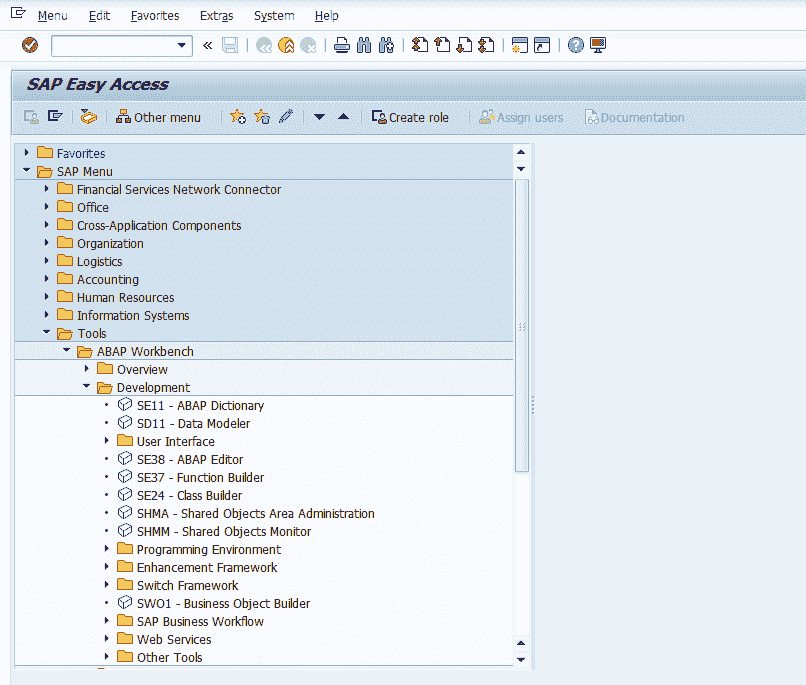

# SAP ABAP 工作台–ABAP/4 工作台工具概述

> 原文：<https://www.tutorialkart.com/sap-abap/sap-abap-workbench/>

## 什么是 SAP ABAP 工作台

SAP ABAP 工作台是一套工具，可用于在 SAP 环境中开发和增强应用程序。SAP 系统的开发集成了各种工具、数据字典和编程语言。

下面的屏幕是 SAP ABAP/4 开发工作台，ABAP 的一名顾问在这里进行开发工作。

<figure class="aligncenter"></figure>

