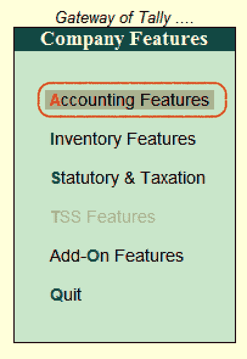

# Tally 中的会计功能(F1:帐户)

> 原文：<https://www.tutorialkart.com/tally/accounting-features-in-tally/>

## Tally 的会计特征是什么

Tally 中的会计功能是公司功能的重要类别之一，由用于会计交易和报告的多种配置和功能组成。可通过按功能键 F11 或点击选项 F11:功能(可在按钮工具栏上找到)打开会计功能

<figure class="aligncenter"></figure>

