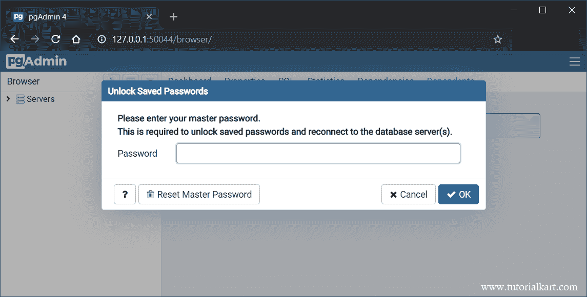

# PostgreSQL–GUI–如何使用？

> 原文：<https://www.tutorialkart.com/postgresql/postgresql-gui/>

## PostgreSQL–GUI

pgAdmin 是 PostgreSQL 的 GUI，包含 PostgreSQL 的管理工具。

安装 PostgreSQL 时，pgAdmin 会与其他工具一起安装。

要启动 pgAdmin，请转到开始菜单并启动 pgAdmin。服务器启动并在浏览器中显示以下窗口。

<figure class="aligncenter"></figure>

从浏览器的 URL 可以得知，服务器已经通过主机 127.0.0.1:50044 为我们提供了一个 Web 接口。

当您打开 pgAdmin 时，会要求您输入您在 PostgreSQL 安装期间设置的主密码。

