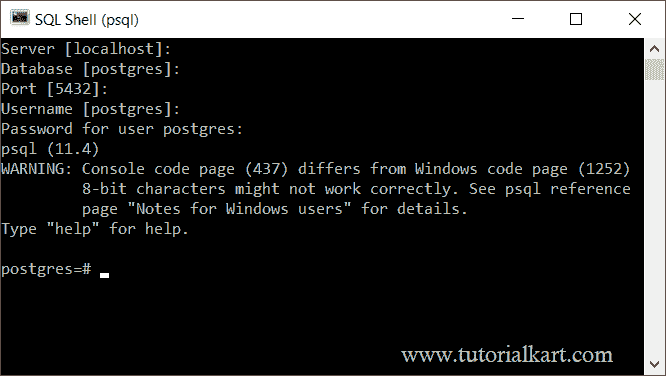

# PostgreSQL–psql Shell 命令

> 原文：<https://www.tutorialkart.com/postgresql/psql-shell-commands/>

## PostgreSQL Shell 命令

在本教程中，我们将学习使用一些 psql 命令在 psql shell 中执行 PostgreSQL 操作。

一旦我们启动 psql shell，我们将被要求提供服务器、数据库、端口、用户名和密码等详细信息。您可以选择默认设置(密码是必须的)。

<figure class="aligncenter"></figure>

