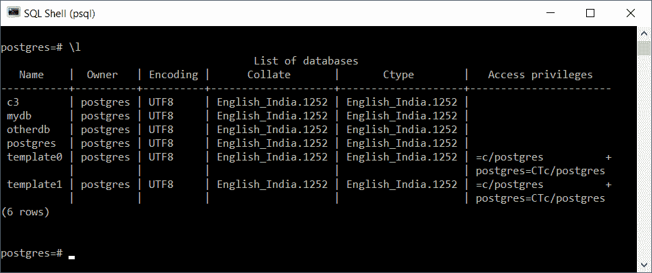

# PostgreSQL–列出数据库

> 原文：<https://www.tutorialkart.com/postgresql/postgresql-list-databases/>

## PostgreSQL–列出数据库

要获得 PostgreSQL 数据库的列表，请打开 psql shell 并运行 list 命令，如下所示。

```
\l
```

在下面的 PostgreSQL shell 中，当我们运行 list databases 命令时，输出是一个包含数据库名称、数据库所有者、数据库编码和其他详细信息的表。

<figure class="aligncenter"></figure>