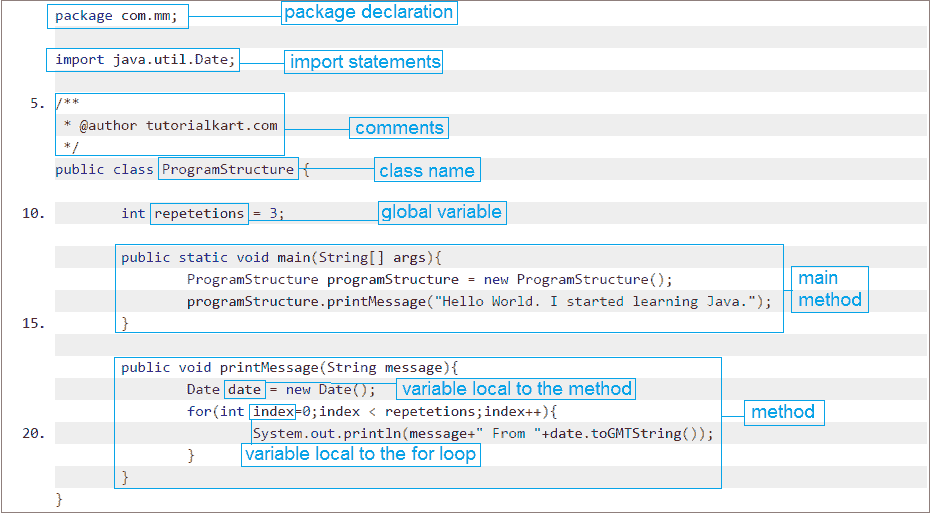

# Java 程序的结构

> 原文：<https://www.tutorialkart.com/java/structure-of-a-java-program/>

## **Java 程序的结构**

Java 程序的典型结构包含以下元素:

*   包装声明
*   导入报表
*   评论
*   类别定义
*   类变量、局部变量
*   方法/惯例/行为

下图显示了上面提到的构成 Java 程序结构的元素。

<figure class="aligncenter">

<figcaption>Structure of a Java program</figcaption>

</figure>

