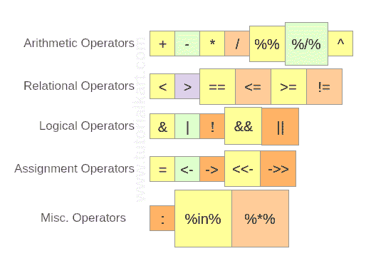

# r 运算符–算术、关系、逻辑、赋值

> 原文：<https://www.tutorialkart.com/r-tutorial/r-operators/>

R 教程——我们将学习 R 操作符——算术、关系、逻辑、赋值和一些 R 编程语言提供的其他操作符。

## r 运算符

R 编程语言中有四种主要的运算符。如下图所示:

<figure class="aligncenter"></figure>

我们将通过示例 R 程序详细了解这些操作符。

