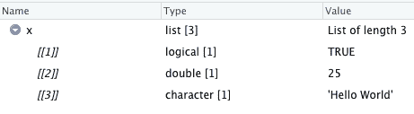

# r 列表

> 原文：<https://www.tutorialkart.com/r-tutorial/r-lists/>

## r 列表

列表是一种通用的向量，它可以存储不同类型的元素。

下面的代码片段是 r 中列表的一个简单例子。

```
x <- list(TRUE, 25, "Hello World")
```

**在 R Studio 中显示矢量 x**

<figure class="wp-block-image size-large is-resized"></figure>

[](https://www.tutorialkart.com/)