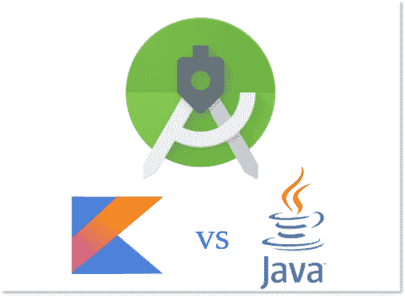

# Android 应用开发中的 Kotlin vs Java

> 原文：<https://www.tutorialkart.com/kotlin-android/kotlin-vs-java-android-application-development/>

Kotlin 与 Java 在 Android 应用程序开发中的比较，考虑了各种语言的特性及其对编码的影响。

<figure class="aligncenter">

<figcaption>Kotlin vs Java in Android Application Development</figcaption>

</figure>

以下是 [Kotlin](https://www.tutorialkart.com/kotlin-tutorial/) 和 [Java](https://www.tutorialkart.com/java/) 在 Android 应用开发上的区别:

