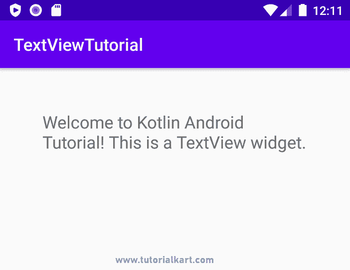

# Android 文本视图

> 原文：<https://www.tutorialkart.com/kotlin-android/android-textview/>

## Android 文本视图

Android TextView 小部件在 UI 中向用户显示文本。

在本教程中，我们将学习如何使用布局 XML 文件创建 TextView，如何从 Kotlin 文件访问布局文件中的 TextView，如何在 Kotlin 文件中创建 TextView 并将其显示给用户，TextView 支持的不同属性，以及涵盖最重要场景的示例。

在下面的截图中，我们有一个文本视图，文本为“欢迎使用 Kotlin Android 教程！这是一个文本视图小部件。。

<figure class="aligncenter"></figure>

