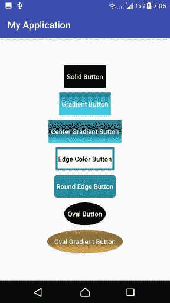

# 如何在 Kotlin Android 中创建按钮背景的自定义设计

> 原文：<https://www.tutorialkart.com/kotlin-android/how-to-create-custom-design-for-button-background-in-kotlin-android/>

## Kotlin Android 中的按钮背景

Android 中有一个按钮的默认样式，但可能不适合你的应用主题。在这个 [Android 教程](https://www.tutorialkart.com/kotlin-android-tutorial/)中，我们将向你展示为按钮背景创建自定义设计的方法。

在下面的截图将有自定义按钮设计，我们将在本教程中创建。

<figure class="aligncenter">

<figcaption>Create custom design for Button in Kotlin Android</figcaption>

</figure>

