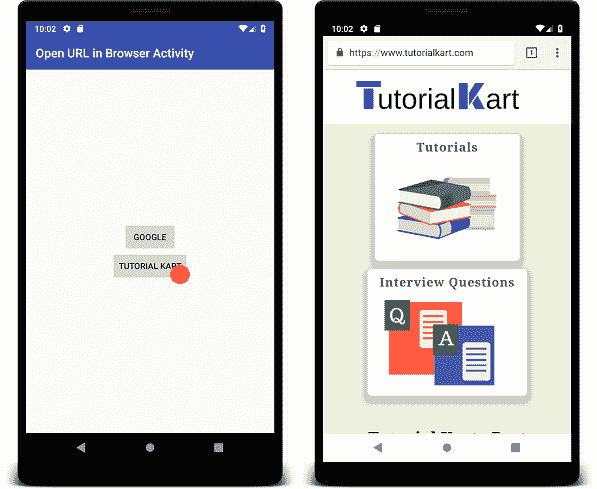

# kot Lin Android–在浏览器活动中单独打开 URL

> 原文：<https://www.tutorialkart.com/kotlin-android/android-open-url-in-browser-activity/>

## 在默认浏览器中打开 Android 应用程序的 URL

在 Android 应用程序中，可能需要在浏览器中单独打开一个 URL。使用操作监听器在视图上执行的任何操作都可以触发打开 URL 的任务。

在本教程中，我们将研究一个应用程序，我们单击一个按钮，一个 URL 将在浏览器窗口中打开。

从下面的屏幕截图来看，当用户点击按钮时，一个新的浏览器活动显示在这个 Android 应用程序上，并带有为该页面指定的 URL。

<figure class="aligncenter"></figure>

