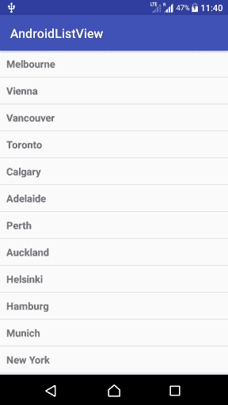

# Kotlin Android ListView 示例

> 原文：<https://www.tutorialkart.com/kotlin-android/kotlin-android-listview-example/>

## Kotlin Android ListView 示例

Android ListView 用于将数组中的项目显示为可滚动列表。

在本教程中，我们将学习如何在 Kotlin Android 应用程序的帮助下使用 Android ListView 显示数组元素。

我们将进一步添加 ListView 项目点击监听器，以便当 ListView 中的项目被点击时，将采取特定的操作。

Android 屏幕中的一个示例 ListView 小部件如下图所示。

<figure class="aligncenter"></figure>

