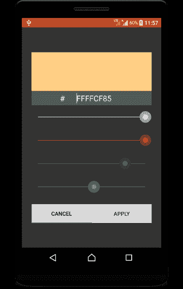

# kot Lin Android–颜色选择器–示例

> 原文：<https://www.tutorialkart.com/kotlin-android/android-color-picker/>

## kot Lin Android–颜色选择器

颜色选择器是一个应用程序，您可以在其中选择特定数量的红色(R)、绿色(G)、蓝色(B)和透明度(A)。

在本教程中，我们将使用 SeekBar 和 Android 的其他基本视图组件实现一个颜色选择器。不得使用第三方库。这是一个简单的颜色选择器，您可以进行自定义更改。要获得完整的源代码，请滚动到教程的末尾。

下面是我们在本教程中构建的示例截图。

<figure class="aligncenter"></figure>

如上图所示，有四个 seekbars，最小值为 0，最大值为 255，用于读取颜色的四个通道(Alpha、红色、绿色、蓝色)。编辑文本可用于输入颜色十六进制值。预览可以在顶部的一个按钮中看到。

<video controls="controls" width="288" height="512">？ <source src="https://www.tutorialkart.com/video/android-color-picker.mp4" type="video/mp4"> ？您的浏览器不支持视频标签。</video>

