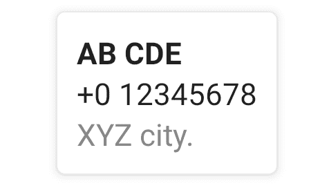

# 安卓合成中的卡片

> 原文：<https://www.tutorialkart.com/android-jetpack-compose/card/>

## Android Jetpack 合成卡

Android Jetpack **卡** composable 用于在凸起的表面上显示其内容。

<figure class="aligncenter size-large is-resized"></figure>

我们可以设置这个可组合卡片的高度和其他样式。

