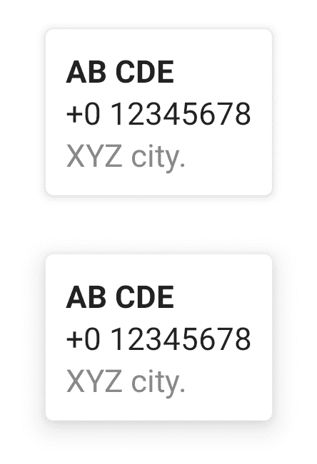

# 如何在 Android Compose 中为卡片设置仰角？

> 原文：<https://www.tutorialkart.com/android-jetpack-compose/card-elevation/>

## Android Jetpack 撰写-为卡片设置高度

要在 Android Jetpack Compose 中设置**卡**的高度，请使用 **Dp** 中的所需值设置`elevation`参数。

<figure class="aligncenter size-large is-resized"></figure>

