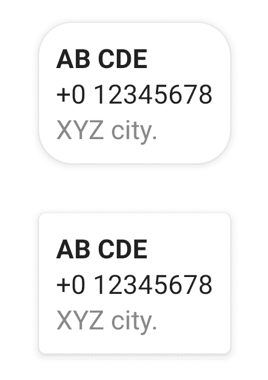

# 如何在 Android Compose 中为卡片设置圆角半径？

> 原文：<https://www.tutorialkart.com/android-jetpack-compose/card-corner-radius/>

## Android Jetpack Compose–设置卡片的圆角半径

要在 Android Jetpack Compose 中为**卡**设置圆角半径，请使用构造函数 RoundedCornerShape()使用 RoundedCornerShape 对象设置`shape`参数，并在 **Dp** 中传递所需的半径值。比如`RoundedCornerShape(20.dp)`。

<figure class="aligncenter size-large is-resized"></figure>

