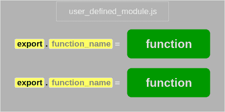

# 如何创建 Node.js 模块

> 原文：<https://www.tutorialkart.com/nodejs/create-a-nodejs-module/>

## 在 Node.js 中创建模块

大多数必要的功能都包含在内置模块中。有时，当您为一个用例实现 Node.js 应用程序时，您可能需要单独保存您的业务逻辑。在这种情况下，您可以创建一个 Node.js 模块，其中包含所有必需的函数。

在这个 Node.js 教程中，我们将学习如何创建一个 Node.js 模块，并通过一个例子将它包含在 Node.js 文件中。

<figure class="aligncenter"></figure>

