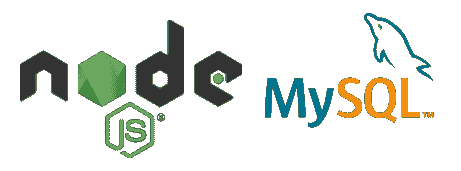

# 节点. js MySQL

> 原文：<https://www.tutorialkart.com/nodejs/nodejs-mysql/>

Node.js MySQL 是 Node.js 的外部库之一，它帮助 Node.js 开发者连接 MySQL 数据库，执行 MySQL 查询。

我们将学习使用 npm 在 Node.js 中安装 MySQL 模块，并使用带有清晰示例的 SQL 语句。

## 节点. js MySQL

下面是我们将要学习的关于 Node.js MySQL 的主题的快速浏览

*   [安装 Node.js MySQL 模块](#Install-MySQL-in-Nodejs)
*   [Node.js MySQL 连接数据库](https://www.tutorialkart.com/nodejs/nodejs-mysql-connect-to-database/)
*   Node.js 中的 MySQL 查询
    *   [MySQL 从表中选择查询](https://www.tutorialkart.com/nodejs/node-js-mysql-select-from-query-examples/)
    *   [MySQL INSERT INTO Table 查询](https://www.tutorialkart.com/nodejs/nodejs-mysql-insert-into/)–node . js MySQL 教程向表中插入记录
    *   [带有选择查询的 MySQL WHERE 子句](https://www.tutorialkart.com/nodejs/nodejs-mysql-where/)
    *   [MySQL ORDER BY 子句带选择查询](https://www.tutorialkart.com/nodejs/nodejs-mysql-order-by/)–node . js MySQL 教程根据表中记录的一个属性按顺序排列记录。
    *   [MySQL 更新表查询](https://www.tutorialkart.com/nodejs/nodejs-mysql-update/)
    *   [MySQL 删除记录查询](https://www.tutorialkart.com/nodejs/nodejs-mysql-delete/)
    *   [在回调函数中使用 MySQL 结果对象](https://www.tutorialkart.com/nodejs/nodejs-mysql-result-object/)
    *   MySQL Fields 对象在回调函数中的使用
    *   MySQL 错误对象在回调函数中的使用

<figure class="aligncenter"></figure>

