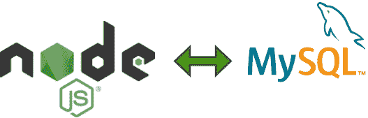

# Node.js MySQL 连接到数据库

> 原文：<https://www.tutorialkart.com/nodejs/nodejs-mysql-connect-to-database/>

## node . js–连接到 MySQL 数据库

在本教程中，我们将通过一个 Node.js 示例程序学习使用`mysql.createConnection`方法连接 Node.js 中的 MySQL 数据库。

Node.js 提供了一个连接 MySQL 数据库并执行 MySQL 操作的模块。

<figure class="aligncenter"></figure>

