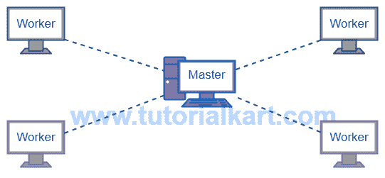

# Apache Spark 集群设置

> 原文：<https://www.tutorialkart.com/apache-spark/how-to-setup-an-apache-spark-cluster/>

Apache Spark 可以配置为作为主节点或 slate 节点运行。在本教程中，我们将学习使用一个主节点和多个从(工作)节点来设置 Apache Spark 集群。您可以将运行 Windows/Linux/MacOS 的电脑设置为主电脑或从电脑。

<figure class="aligncenter"></figure>

## 设置 Apache Spark 集群

要设置 Apache Spark 集群，我们需要知道两件事:

1.  设置主节点
2.  设置工作节点。

