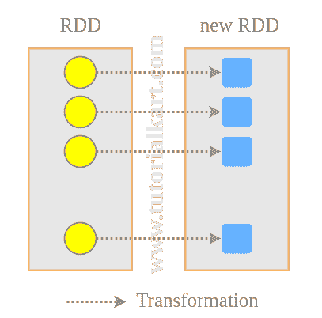

# 火花 RDD 地图()–Java 和 Python 示例

> 原文：<https://www.tutorialkart.com/apache-spark/spark-rdd-map-java-python-examples/>

## 火花 RDD 地图()

在这个 [Spark 教程](https://www.tutorialkart.com/apache-spark-tutorial/)中，我们将学习将一个 RDD 映射到另一个。映射是使用函数变换每个 RDD 元素并返回一个新的 RDD。一个简单的例子是计算每个 RDD 元素的对数值(RDD <整数>)并用返回的元素创建一个新的 RDD。

<figure class="aligncenter"></figure>

*   [语法](#Syntax-RDD-map)
*   [Java 示例](#Java-Examples)
*   [Python 示例](#Python-Examples)

