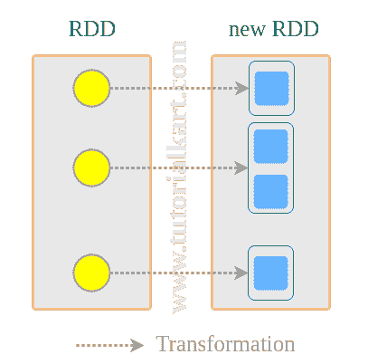

# 火花 RDD 平面图()

> 原文：<https://www.tutorialkart.com/apache-spark/spark-rdd-flatmap/>

## 火花 RDD 平面图()

在这个 [Spark 教程](https://www.tutorialkart.com/apache-spark-tutorial/)中，我们将学习**将一个 RDD**平面映射到另一个。平面映射使用一个函数转换每个 RDD 元素，该函数可以将多个元素返回到新 RDD。一个简单的例子是对字符串应用平面图，并使用 split 函数将单词返回到新 RDD。

<figure class="aligncenter"></figure>

