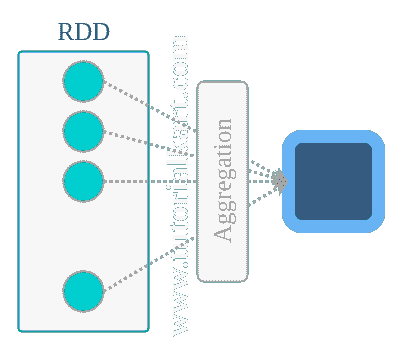

# spark RDD reduce()–Java 和 Python 示例

> 原文：<https://www.tutorialkart.com/apache-spark/spark-rdd-reduce/>

## 火花 RDD 减少()

在这个 [Spark 教程](https://www.tutorialkart.com/apache-spark-tutorial/)中，我们将学习把一个 RDD 简化为一个元素。 **Reduce** 是使用函数的元素集合。

<figure class="aligncenter"></figure>

下面是聚合函数应该具有的两个重要属性

1.  **可交换的**A+B = B+A–确保结果独立于被聚合的 RDD 中元素的顺序。
2.  **关联**(A+B)+C = A+(B+C)-确保聚合中任何两个关联的元素不会影响最终结果。

这种函数的例子是加法、乘法、OR、AND、XOR、XAND。

