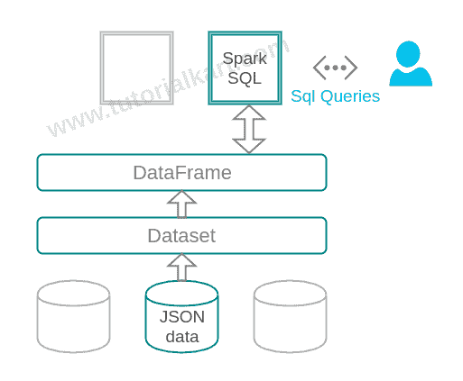

# 如何在 Spark SQL 中从 JSON 文件加载数据并执行 SQL 查询

> 原文：<https://www.tutorialkart.com/apache-spark/load-data-from-json-file-and-execute-sql-query/>

从 JSON 数据源加载数据并执行 Spark SQL 查询

Apache Spark 数据集和 DataFrame APIs 提供了对数据源中的 [Spark SQL](https://www.tutorialkart.com/apache-spark/apache-spark-sql-library-features-architecture-examples/) 的抽象。Dataset 提供了 rdd 的优点以及 Spark SQL 执行引擎的优化优势。

Dataset 将 JSON 数据源作为分布式数据集合加载。DataFrame 是一个数据集，其中的数据排列在指定的列中。包含 JSON 数据源、数据集、数据帧和 Spark SQL 的架构如下所示:

<figure class="aligncenter">

<figcaption>JSON -> Dataset -> DataFrame -> Spark SQL -> SQL Query</figcaption>

</figure>

## 从 JSON 文件加载数据并执行 SQL 查询

以下是从 JSON 文件加载数据并对从 JSON 文件加载的数据执行 SQL 查询的逐步过程。

