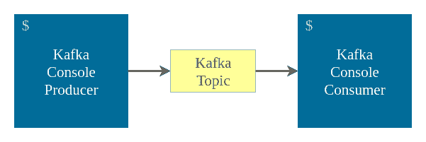

# Kafka 控制台生产商和消费者示例

> 原文：<https://www.tutorialkart.com/apache-kafka/kafka-console-producer-and-consumer-example/>

## Kafka 控制台生产商和消费者示例

**Kafka 控制台生产者和消费者示例**——在本 [Kafka 教程](https://www.tutorialkart.com/apache-kafka-tutorial/)中，我们将学习使用 Kafka 的控制台界面创建 Kafka 生产者和 Kafka 消费者。

kafka 目录中的 bin/kafka-console-producer.sh 和 bin/kafka-console-consumer.sh 是分别帮助创建 kafka 生产者和 Kafka 消费者的工具。

<figure class="aligncenter"></figure>

我们将从一个基本示例开始，在 Kafka Producer 的帮助下向从控制台读取的 Kafka 主题写入消息，并使用 Kafka Consumer 从主题读取消息。

